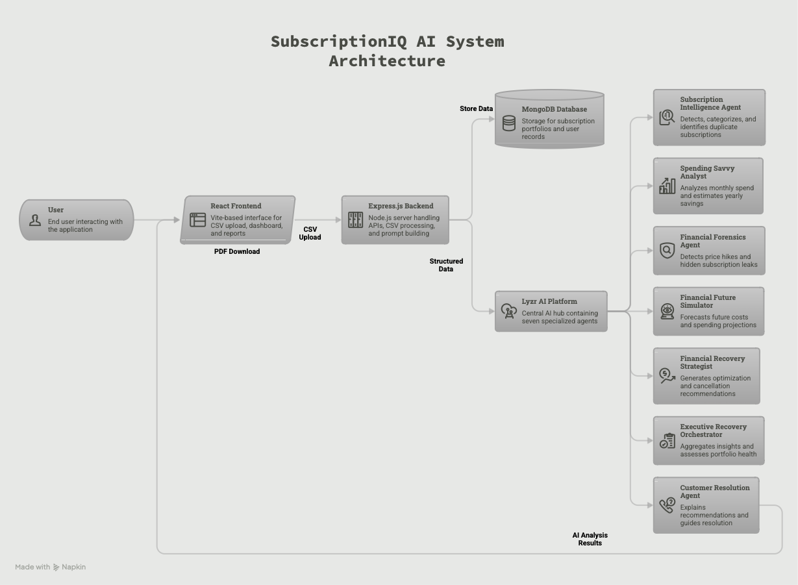
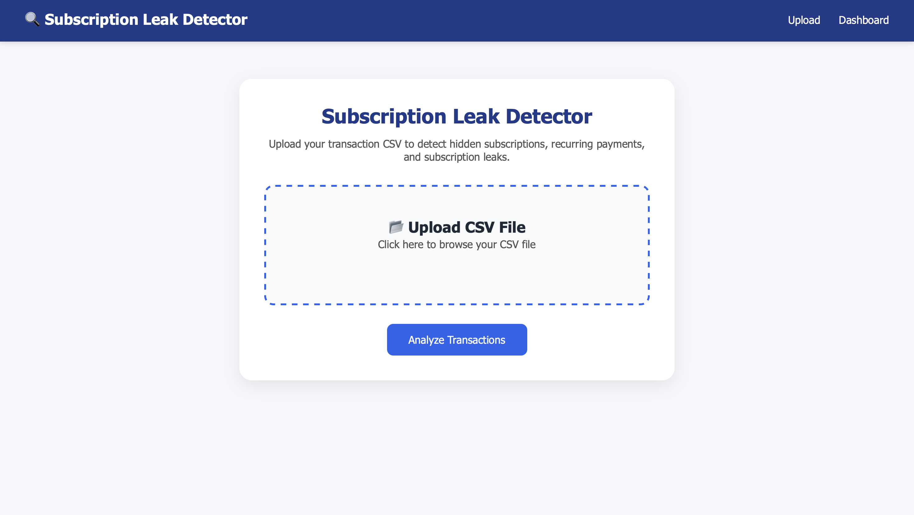
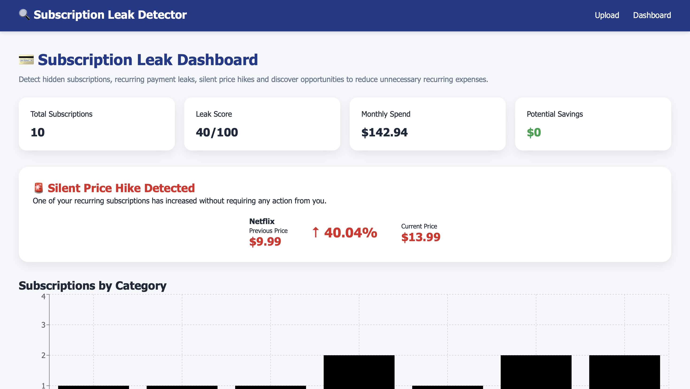
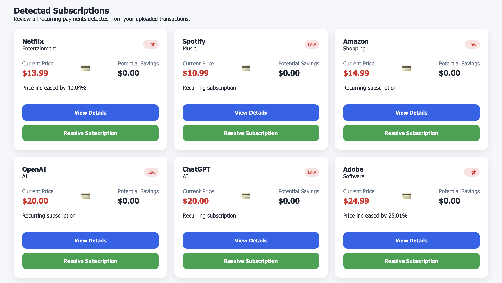
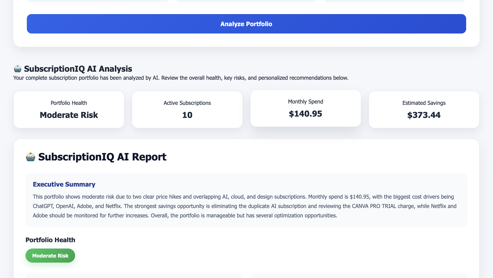
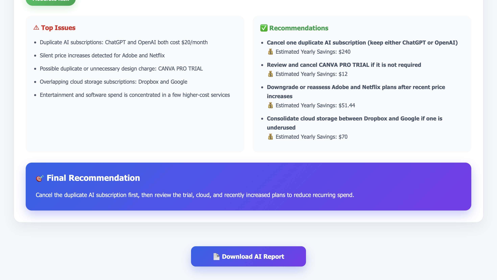
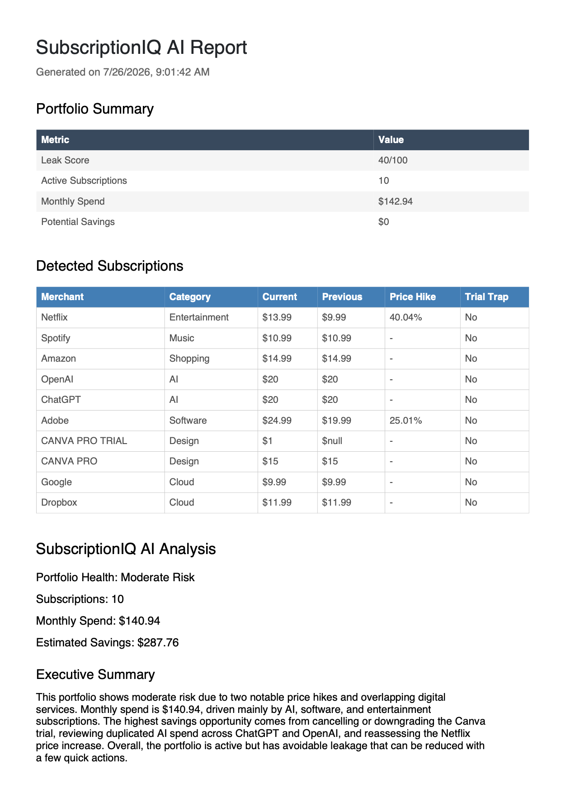

# 🚀 SubscriptionIQ AI
### AI-Powered Hidden Subscription & Recurring Payment Leak Detector

<p align="center">

🏆 **INNOVA HACK 2026**

**Team: Tech Nova**

**"Empowering users to eliminate hidden subscription leaks and make smarter financial decisions through AI-powered intelligence."**

</p>

---

# 📌 Problem Statement

In today's digital world, users subscribe to multiple online services such as OTT platforms, cloud storage, productivity tools, fitness applications, music streaming, and premium software. As the number of subscriptions increases, users often lose visibility into their recurring expenses.

This leads to several financial challenges:

- 💳 Forgotten subscriptions that continue charging every month
- 🔁 Auto-renewed free trials that convert into paid plans
- 📈 Unexpected price hikes without user awareness
- 🔍 Duplicate subscriptions across multiple platforms
- 💸 Unused premium services consuming monthly budgets
- 📊 Lack of actionable financial insights for optimizing recurring spending

Existing banking and expense-tracking applications primarily display transactions but rarely analyze recurring payments or provide intelligent recommendations to help users reduce unnecessary subscription costs.

---

# 💡 Our Solution

**SubscriptionIQ AI** is an AI-powered subscription intelligence platform that transforms raw bank transaction data into meaningful financial insights.

Users simply upload their bank transaction history in CSV format, and the platform automatically:

- Detects recurring subscriptions
- Identifies hidden financial leaks
- Calculates monthly subscription spending
- Detects price hikes and duplicate subscriptions
- Estimates yearly savings opportunities
- Generates AI-powered financial recommendations
- Produces downloadable professional reports

Instead of acting as a traditional expense tracker, SubscriptionIQ AI serves as a personal AI financial advisor focused specifically on recurring subscription management.

---

# 🎯 Objectives

Our primary objectives are:

- Detect hidden recurring subscriptions
- Identify duplicate subscriptions
- Detect silent price hikes
- Detect trial trap subscriptions
- Analyze monthly recurring expenses
- Estimate yearly savings opportunities
- Generate AI-powered recommendations
- Improve users' financial awareness
- Help users optimize subscription spending
- Reduce unnecessary recurring financial leaks

---

# ✨ Key Features

## 📂 CSV Upload

- Upload bank transaction history
- Automatic subscription extraction
- Intelligent recurring payment detection
- Fast CSV processing

---

## 📊 Interactive Dashboard

Provides real-time insights including:

- Active Subscriptions
- Monthly Subscription Spend
- Subscription Leak Score
- Potential Savings
- Silent Price Hike Alerts
- Category-wise Subscription Distribution

---

## 🔍 Subscription Leak Detection

Automatically detects:

- Hidden recurring payments
- Duplicate subscriptions
- Trial traps
- Price hikes
- Spending anomalies
- High-risk subscriptions

---

## 🤖 AI Portfolio Analysis

Powered by the **Lyzr AI Platform**, the system generates:

- Executive Summary
- Portfolio Health Assessment
- Monthly Spending Analysis
- Estimated Yearly Savings
- Top Financial Issues
- Personalized Recommendations
- Final Financial Strategy

---

## 📄 AI Report Generation

Generate a professional downloadable PDF report containing:

- Portfolio Summary
- Subscription Details
- Executive Summary
- Portfolio Health
- AI Recommendations
- Estimated Savings
- Final Recommendation

---

# 🤖 Multi-Agent AI Architecture

SubscriptionIQ AI is powered by a **suite of seven specialized Lyzr AI Agents**, each responsible for a specific financial intelligence task. This modular AI architecture improves scalability, maintainability, and enables future expansion into a fully orchestrated intelligent financial assistant.

Unlike traditional AI applications that rely on a single model, SubscriptionIQ AI distributes responsibilities across multiple specialized agents to produce more accurate and actionable insights.

---

## 🧠 1. Subscription Intelligence Agent

### Responsibilities

- Detect recurring subscriptions
- Categorize subscriptions
- Identify duplicate services
- Build the user's subscription portfolio
- Detect recurring payment patterns

---

## 💰 2. Spending Savvy Analyst

### Responsibilities

- Analyze monthly subscription spending
- Calculate recurring expenses
- Estimate yearly savings
- Highlight expensive subscriptions
- Identify unnecessary recurring costs

---

## 🔍 3. Financial Forensics Agent

### Responsibilities

- Detect hidden subscription leaks
- Identify unexpected price hikes
- Detect suspicious recurring transactions
- Flag financial anomalies
- Analyze abnormal spending behavior

---

## 📈 4. Financial Future Simulator

### Responsibilities

- Forecast future subscription expenses
- Predict long-term financial impact
- Estimate future recurring costs
- Simulate savings after recommendations
- Generate financial projections

---

## 🎯 5. Financial Recovery Strategist

### Responsibilities

- Recommend subscription cancellations
- Suggest plan downgrades
- Recommend optimization strategies
- Prioritize savings opportunities
- Generate cost-reduction strategies

---

## 📋 6. Executive Recovery Orchestrator

### Responsibilities

- Consolidate outputs from all AI agents
- Generate Executive Summary
- Assess Portfolio Health
- Produce Final Recommendation
- Create overall financial strategy

---

## 🤝 7. Customer Resolution Agent

### Responsibilities

- Explain AI recommendations
- Assist users in resolving subscription issues
- Provide financial guidance
- Simplify decision making
- Improve user experience

---

# 🔄 AI Workflow

```text
                  User Uploads CSV
                         │
                         ▼
            Subscription Detection Engine
                         │
                         ▼
              Structured Subscription Data
                         │
                         ▼
                  Prompt Builder
                         │
                         ▼
                  Lyzr AI Platform
                         │
      ┌──────────────────┼──────────────────┐
      ▼                  ▼                  ▼
Subscription      Spending Savvy     Financial
 Intelligence         Analyst         Forensics
      │                  │                 │
      └─────────────┬────┴─────────────────┘
                    ▼
        Financial Future Simulator
                    │
                    ▼
     Financial Recovery Strategist
                    │
                    ▼
 Executive Recovery Orchestrator
                    │
                    ▼
     Customer Resolution Agent
                    │
                    ▼
      AI Dashboard + Downloadable PDF
```

---

# 🏗️ System Architecture

The following architecture illustrates how SubscriptionIQ AI integrates the React frontend, Express backend, MongoDB database, and the Lyzr AI multi-agent ecosystem to generate intelligent financial insights.

<p align="center">
  
</p>

---

# ⚙️ Tech Stack

## 🎨 Frontend

- React.js
- Vite
- CSS3

---

## ⚙️ Backend

- Node.js
- Express.js

---

## 🗄️ Database

- MongoDB
- Mongoose

---

## 🤖 AI Platform

- Lyzr AI

---

## 📚 Libraries & Tools

- PapaParse
- Multer
- jsPDF
- jsPDF-AutoTable
- Axios
- Git & GitHub

---

## ☁️ Deployment

- **Frontend:** Vercel
- **Backend:** Render

---

# 🔄 Application Workflow

The complete workflow of SubscriptionIQ AI is illustrated below:

1. 📂 User uploads a bank transaction CSV.
2. 🔍 The backend detects recurring subscription payments.
3. 🗂️ Subscription portfolio is created and stored in MongoDB.
4. 📝 A structured AI prompt is generated.
5. 🤖 Lyzr AI Agents analyze the subscription portfolio.
6. 📊 AI insights are displayed on the dashboard.
7. 💡 Personalized recommendations are generated.
8. 📄 Users can download a professional AI-generated PDF report.

---

# 💡 Innovation

SubscriptionIQ AI goes beyond traditional expense tracking by combining artificial intelligence with intelligent subscription analysis.

### Our key innovations include:

- 🤖 Multi-Agent AI Architecture
- 🔍 Hidden Subscription Leak Detection
- 📈 Portfolio Health Assessment
- 💰 Estimated Yearly Savings
- 📊 AI-Powered Spending Analysis
- 📄 Executive Financial Summary
- 💡 Personalized Financial Recommendations
- 📥 Professional Downloadable PDF Reports

Unlike conventional finance applications that only display transactions, SubscriptionIQ AI interprets spending behavior and provides actionable financial guidance to help users optimize recurring expenses.

---

# 🌍 Real-World Impact

SubscriptionIQ AI helps users:

- Reduce recurring financial leaks
- Detect forgotten subscriptions
- Avoid unnecessary renewals
- Identify duplicate subscriptions
- Detect silent price hikes
- Improve financial awareness
- Optimize monthly subscription spending
- Increase long-term savings

### Potential Users

- 👨‍🎓 Students
- 👩‍💼 Working Professionals
- 👨‍👩‍👧 Families
- 💼 Freelancers
- 🏢 Small Businesses

---

# 📈 Scalability

SubscriptionIQ AI has been designed with a modular architecture that supports future expansion.

### Planned Enhancements

- 🏦 Bank API Integration
- 📱 Mobile Application
- 💳 UPI Transaction Analysis
- 📧 Gmail Invoice Scanner
- 🔔 Subscription Renewal Notifications
- 📊 Monthly AI Financial Reports
- 🤖 AI Budget Forecasting
- 🏦 Multi-Bank Support
- 🧠 Personal AI Finance Assistant

---

# 🔒 Security

SubscriptionIQ AI prioritizes secure data handling through:

- Secure REST APIs
- Server-side Validation
- MongoDB Database Storage
- Backend AI Integration
- Modular Architecture
- Secure File Upload Processing

---

# 📂 Repository Structure

```text
innova-hackathon/
│
├── backend/
│   ├── controllers/
│   ├── models/
│   ├── routes/
│   ├── services/
│   ├── utils/
│   └── ...
│
├── frontend/
│   ├── src/
│   ├── components/
│   ├── pages/
│   ├── styles/
│   └── ...
│
├── screenshots/
│   ├── architecture.png
│   ├── upload-page.png
│   ├── dashboard-overview.png
│   ├── subscription-list.png
│   ├── ai-analysis.png
│   ├── recommendations.png
│   ├── pdf-report.png
│   └── lyzr-agents.png
│
└── README.md
```

---

# 🚀 Deployment

## 🌐 Live Demo

### Frontend

👉 https://innova-hackathon.vercel.app

### Backend API

👉 https://innova-hackathon-tech-nova.onrender.com

---

# 📸 Project Screenshots

## 📂 CSV Upload Interface

Upload a bank transaction CSV to begin intelligent subscription detection.



---

## 📊 Interactive Dashboard

Monitor all subscriptions through an interactive dashboard displaying:

- Active Subscriptions
- Monthly Spend
- Leak Score
- Potential Savings
- Category Analytics



---

## 🔍 Detected Subscription Portfolio

Automatically detected recurring subscriptions with AI-generated insights.



---

## 🤖 AI Portfolio Analysis

Comprehensive AI-generated financial analysis including:

- Executive Summary
- Portfolio Health
- Estimated Savings
- Spending Insights



---

## 💡 AI Recommendations

Receive personalized recommendations for reducing recurring expenses and improving financial efficiency.



---

## 📄 Downloadable PDF Report

Generate a professional PDF report containing:

- Subscription Portfolio
- Executive Summary
- AI Insights
- Recommendations
- Final Strategy



---


# 🏆 Why SubscriptionIQ AI?

SubscriptionIQ AI isn't just another expense tracker.

It is an intelligent financial assistant that:

- Detects hidden subscription leaks
- Predicts future spending
- Identifies savings opportunities
- Provides personalized recommendations
- Helps users make smarter financial decisions

By combining modern web technologies with a specialized AI multi-agent architecture, SubscriptionIQ AI transforms raw transaction data into actionable financial intelligence.

---

# 👥 Team

### 🏆 Team Name

**Tech Nova**

Developed for **INNOVA HACK 2026**

---

# 📄 License

This project was developed for educational purposes as part of **INNOVA HACK 2026**.

---

# 🌟 Thank You

<p align="center">

## 🚀 SubscriptionIQ AI

### *"Empowering users to eliminate hidden subscription leaks and make smarter financial decisions through AI-powered intelligence."*

⭐ If you found this project interesting, don't forget to star the repository!

</p>
